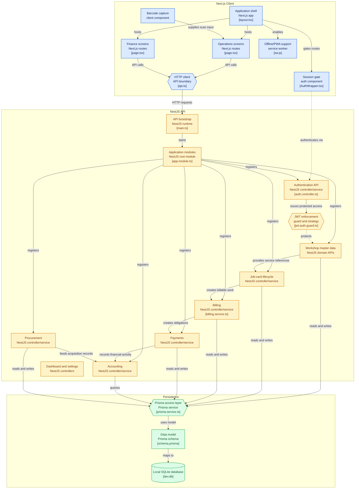

# 🚗 Garage Book  

> **A Smart Garage Management System**  
> A modern, digital solution designed to efficiently manage garage operations, replacing traditional manual record-keeping with a fast, organized, and user-friendly system.

---

## 📖 Overview

**Garage Book** is a comprehensive garage management web application tailored to streamline daily workshop activities. It empowers garage owners to seamlessly manage customer information, track vehicle service history, handle billing processes, and maintain parts inventory in a structured and efficient way.

Built with modern web technologies, this project focuses on improving productivity, minimizing human errors, and providing a professional workflow for automobile workshops of all sizes.

---

## 🚀 Key Features

- **👤 Customer Management**: Easily add, update, and track customer profiles and service history.
- **🚗 Vehicle & Service Management**: Store multiple vehicles per customer, track repair histories, and maintain detailed job cards.
- **💰 Billing & Invoicing**: Generate accurate invoices automatically, track payments, and manage service charges without manual calculation errors.
- **📦 Inventory Management**: Maintain a parts catalog with built-in barcode/SKU generation and bulk Excel import/export functionality.
- **🛠️ Workshop Bays & Mechanics**: Assign jobs to specific mechanics and manage workshop bay utilization.
- **⚡ Built for Speed**: Includes zero-lag pagination (`pagebutton`) and live multi-field auto-fill (`Autofill 2`) to ensure data entry is lightning fast.

---

## 🛠️ Tech Stack

This project is built using a modern, full-stack JavaScript/TypeScript architecture.

### **Frontend**
- **Framework**: [Next.js](https://nextjs.org/) (React)
- **Language**: TypeScript
- **Styling**: CSS / UI Components
- **State Management & Data Fetching**: React Hooks, Axios
- **Other Tools**: Lucide React (Icons), SheetJS (Excel parsing)

### **Backend**
- **Framework**: [NestJS](https://nestjs.com/)
- **Language**: TypeScript
- **ORM**: [Prisma](https://www.prisma.io/)
- **Authentication**: JWT (JSON Web Tokens), Passport
- **Database**: SQLite / PostgreSQL (Configurable via Prisma)

---

## 📂 Project Structure

```text
GarageBook/
│
├── frontend/             # Next.js web application
│   ├── src/app/          # Next.js App Router pages
│   ├── src/components/   # Reusable React components
│   └── public/           # Static assets
│
├── backend/              # NestJS API server
│   ├── src/              # Controllers, Services, and Modules
│   └── prisma/           # Database schema and migrations
│
├── .agents/              # Custom AI Agent configurations and rules
└── README.md             # Project documentation
```

---

## 🏗️ Architecture



---

## ⚙️ Getting Started

### 🔧 Prerequisites

Ensure you have the following installed on your local machine:
- **Node.js** (v18 or higher)
- **npm** (or yarn/pnpm)
- **Git**

### 📥 Installation & Setup

1. **Clone the repository**
   ```bash
   git clone https://github.com/manish-sherawat/Garage-Book.git
   cd Garage-Book
   ```

2. **Setup the Backend**
   ```bash
   cd backend
   npm install
   # Set up your environment variables (create a .env file)
   # Run Prisma migrations
   npx prisma migrate dev
   # Start the backend server
   npm run start:dev
   ```

3. **Setup the Frontend**
   ```bash
   cd ../frontend
   npm install
   # Start the Next.js development server
   npm run dev
   ```

4. **Access the Application**
   Open your browser and navigate to `http://localhost:3000` (or the port specified by Next.js). The API will typically be running on `http://localhost:3001` (or as configured).

---

## 📄 License

This project is licensed under the MIT License.
